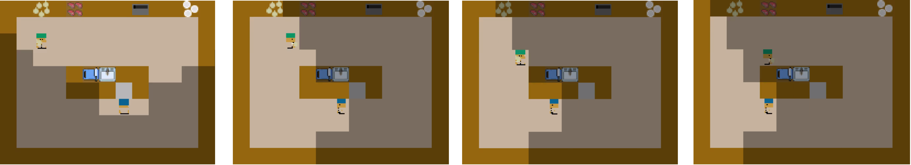
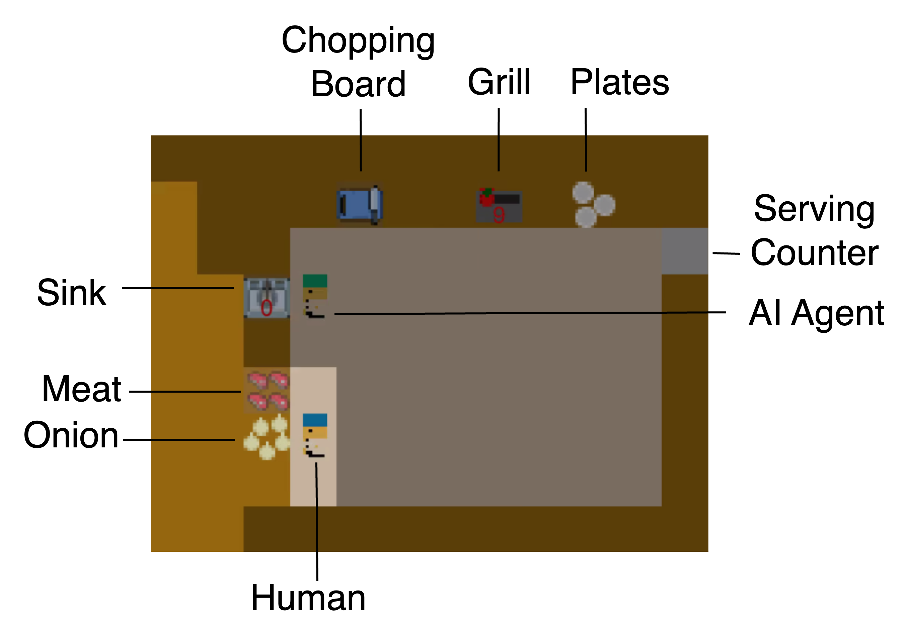
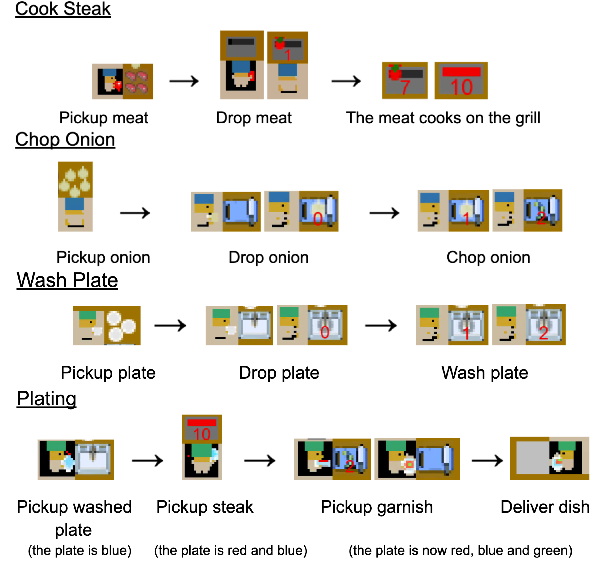
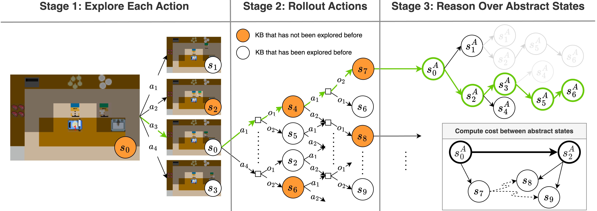

# Integrating Field of View in Human-Aware Collaborative Planning

The 2D Grid World is a simulation environment designed to explore the dynamics of human-AI collaboration. It focuses on how AI can assist humans in completing tasks by considering the human's field of view (FOV), cognitive limitations, and task planning in a grid-based environment.

<p align="center">
  
  <br> Example of a 2D Grid World layout with agents performing tasks while considering the human's field of view (tiles that are dimmed).
</p>


## Introduction

The 2D Grid World is a benchmark environment for cooperative human-AI interaction. Inspired by task-based collaborative games such as Overcooked, this environment simulates scenarios where humans and AI agents must work together to complete tasks like cooking, cleaning, or assembling items.

The key feature of this environment is the integration of a **limited Field of View (FOV)** for the human collaborator, which mimics the human's real-world perception constraints. The AI agent, therefore, must account for the human's restricted view when selecting actions, ensuring better task coordination.

### Key Features
- **Collaborative Task Planning**: Both the human and AI must complete multiple subtasks (e.g., cooking, cleaning) to achieve a shared goal.
- **Field of View Awareness**: The AI adapts its strategy by understanding and acting within the limited FOV of the human agent.
- **Procedural Task Layouts**: The environment supports customizable layouts to simulate various task settings, such as kitchens or workspaces.

### Installation

It is useful to setup a conda environment with Python 3.8 using
[Anaconda](https://www.anaconda.com/products/individual):

```
conda create -n overcooked_ai python=3.8
conda activate overcooked_ai
```

To complete the installation after cloning the repo, run the following commands:

```
cd FOV-aware-planner
pip install -e .
```

### Overcooked-AI Code Structure Overview

`overcooked_ai_py` contains:

`mdp/`:

- `overcooked_mdp.py`: main Overcooked game logic
- `overcooked_env.py`: environment classes built on top of the Overcooked mdp
- `layout_generator.py`: functions to generate random layouts programmatically
- `actions`: actions that agents can take
- `graphics`: render related functions

`agents/`:

- `agent.py`: location of agent classes
- `benchmarking.py`: sample trajectories of agents (both trained and planners)
  and load various models

`planning`:

- `planners.py`: near-optimal agent planning logic
- `search.py`: A\* search and shortest path logic

## Steak Task Instructions

### Objective:
Prepare and deliver a steak dish with garnish (onion) using the least number of steps. The task requires completing the following subtasks: grilling the steak, chopping the onion, washing a plate, plating and serving the dish.

### Steps to Complete the Steak Task:

<p align="center">
  
  
</p>

### FOV-Aware Collaboration Planning 

<p align="center">
  
  <br> Human's FOV-aware collaboration planner.
</p>


## Citation ##
Please cite this work using the following Bibtex:
```
Coming soon
```

## Contact ##
For any questions, please reach out to: [yachuanh@usc.edu](mailto:yachuanh@usc.edu)
