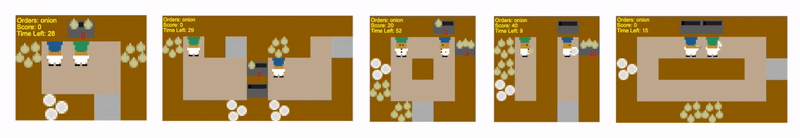

# Overcooked-AI-PCG

Overcooked-AI-PCG is a Procedural Content Generation project aiming to generate Overcooked-Ai game levels that would cause undesirable behaviors while Human and AI play cooperatively in the environment.

## Overcooked-AI
<p align="center">
  <!--  -->
  
  <i>5 of the available layouts. New layouts are easy to hardcode or generate programmatically.</i>
</p>

### Introduction

Overcooked-AI is a benchmark environment for fully cooperative multi-agent performance, based on the wildly popular video game [Overcooked](http://www.ghosttowngames.com/overcooked/).

The goal of the game is to deliver soups as fast as possible. Each soup requires taking 3 items and placing them in a pot, waiting for the soup to cook, and then having an agent pick up the soup and delivering it. The agents should split up tasks on the fly and coordinate effectively in order to achieve high reward.

You can **try out the game [here](https://humancompatibleai.github.io/overcooked-demo/)** (playing with some previously trained DRL agents).

For more information about the environment, please check out the [original Overcooked-AI repo](https://github.com/HumanCompatibleAI/overcooked_ai).

### Install Overcooked-AI

It is useful to setup a conda environment with Python 3.7:

```
conda create -n overcooked_ai python=3.7
conda activate overcooked_ai
```

To complete the installation after cloning the repo, run the following commands:

```
cd overcooked_ai
python setup.py develop
```

### Verifying Installation

To verify your python installation, you can try running the following command from the inner `overcooked_ai_py` folder:

```
python run_tests.py
```

If you're thinking of using the planning code extensively, you should run (this can take 5-10 mins): `python run_tests_full_planning_suite.py`


### Overcooked-AI Code Structure Overview

`overcooked_ai_py` contains:

`mdp/`:
- `overcooked_mdp.py`: main Overcooked game logic
- `overcooked_env.py`: environment classes built on top of the Overcooked mdp
- `layout_generator.py`: functions to generate random layouts programmatically
- `actions`: actions that agents can take
- `graphics`: render related functions

`agents/`:
- `agent.py`: location of agent classes
- `benchmarking.py`: sample trajectories of agents (both trained and planners) and load various models

`planning`:
- `planners.py`: near-optimal agent planning logic
- `search.py`: A* search and shortest path logic

`run_tests.py`: script to run all tests

### Python Visualizations
To test the visualization mechanism of Overcooked-AI, please run the following:

```bash
cd overcooked_ai_py
python test_render.py
```

A pygame window should pop up and two agents should start performing random actions in the environment.

## PCG for Overcooked-AI

### GAN Training

To train the GAN that generates Overcooked-AI levels, run the following:

```bash
cd overcooked_ai_pcg/GAN_training
python train_gan.py --cuda
```

### Mixed Integer Linear Programming Solver

The solver is defined in `overcooked_ai_pcg/milp_repair.py`.

It uses [cplex optimizer of IBM](https://www.ibm.com/analytics/cplex-optimizer). Please follow the step [here](https://www.ibm.com/products/ilog-cplex-optimization-studio) to install **IBM ILOG CPLEX Optimization Studio** and the python interface of it.

### Generate level using trained GAN and MILP solver

To use trained GAN and the MILP solver to generate Overcooked-AI levels, run the following:

```bash
cd overcooked_ai_pcg/GAN_training
python gen_gan.py
```

The program will generate a level from random latent vector sampled from normal distribution and then use MILP solver defined in `overcooked_ai_pcg/milp_repair.py` to fix the level.

### Latent Space Illumination

To run LSI experiments, run the following:
```bash
cd overcooked_ai_pcg/LSI
python run_search.py -w <workerID> -c <exp_config_file_path>
```

`workerID` is a positive integer specifying which trial in the experiment to run. The ID would be related to `num_trials` field of the experiment config file. For example, for the following experiment config file:

```
Visualize=false

[[Trials]]
num_trials=5
trial_config="RANDOM_demo.tml"

[[Trials]]
num_trials=5
trial_config="MAPELITES_demo.tml"
```

`workerID` from `1` to `5` would be running Random search, while `workerID` from `6` to `10` would be running MAP-Elites QD algorithm.

`exp_config_file_path` is the filepath to the experiment config file. It is default to be `overcooked_ai_pcg/LSI/data/config/experiment/experiments.tml`

#### LSI config files

There are four kinds of config files, each configuring different components of the LSI experiments.

##### `experiment` config files
They are under `overcooked_ai_pcg/LSI/data/config/experiment`.

They are the entry points of the config files. An experiment includes a list of paths to trial config files.

##### `trial` config files
They are under `overcooked_ai_pcg/LSI/data/config/trials`.

A trial config file contains algorithm, name of the trial, number of evaluations to run, and paths of algorithm and feature map config files of the trail to run.

The name of the trial config files strictly follows the format of `<algorithm name>_<elite map name>`.

##### `algorithm` config files
They are under `overcooked_ai_pcg/LSI/data/config/algorithms`.

An algorithm config file contains hyper params of the algorithm to run. For example, for MAP-Elites, they are initial population and mutation power.

##### `elite_map` config files
They are under `overcooked_ai_pcg/LSI/data/config/elite_map`.

An elite map config file contains the names and the range of the behavior characteristics to be used for the QD algorithms.


### Making More GAN Training Data

The size of the training levels is fixed to be 15(width) x 10(height). The available tile types are:

```
'1': Player 1
'2': Player 2
'X': Wall
'S': Serve Point
'P': Pot
'O': Onion Dispenser
'D': Dish Dispenser
' ': Floor
```

Please make sure that the levels you make satisfy **ALL** of the following constraints:

1. The level must be **rigidly surrounded**. i.e. the first and last row, and the first and last column can be anything except `‘1’`, `‘2’`, and `‘ ’`.

2. There are **exactly 2 players** at different positions. But they cannot be at the first and last row, and the first and last column.

3. There is **at least one** `‘O’`.

4. There is **at least one** `‘D’`.

5. There is **at least one** `‘P’`.

6. There is **at least one** `‘S’`.

7. `‘O’`, `‘D’`, `‘P’`, `‘S’` can be **anywhere**.

8. Both of the players must be able to reach at least one of `‘O’`, `‘D’`, `‘P’`, and `‘S’`.

9. The size is exactly **15(width) x 10(height)**

Please grab a version of `overcooked_ai_py/data/layouts/base.layout` to make the levels and place it under `overcooked_ai_py/data/layouts`. **Be sure to add prefix `gen` to its file name to differentiate it from non-GAN-training layouts.**

Note: These are also the constraints that the MILP solver is trying to satisfy.

### Overcooked-AI-PCG Code structure Overview

`overcooked_ai_pcg/` contains:

- `milp_repair.py`: Mixed Integer Linear Programming solver to fix levels generated by GAN.

- `gen_lvl.py`: Script that generates a level from trained GAN and repair that level using MILP solver.

- `helper.py`: helper functions

- `GAN_training/`:
  - `dcgan.py`: Deep Convolutional Generative Adversarial Network Code
  - `train_gan.py`: GAN training script

- `LSI/`:
  - `bc_calculate.py`: Relevant functions to calculate behavior characteristics
  - `qd_algorithms.py`: Implementations of QD algorithms
  - `search.py`: Relevant functions to run the LSI search
  - `run_search.py`: Script to run LSI search
  - `data/`: config and log data and LSI experiment